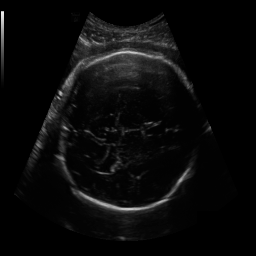
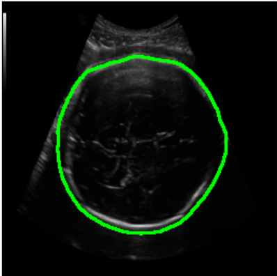
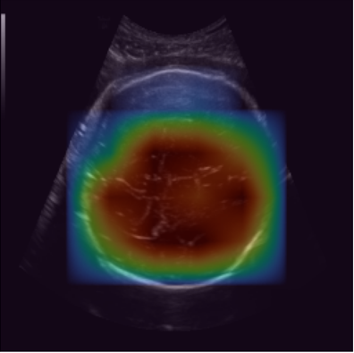

# 🧠 Fetal Head Segmentation & Circumference Estimation

Implementation of multiple deep learning models for fetal head segmentation from ultrasound images, along with a proposed improved architecture for enhanced performance.

---

## 🚀 Overview

This project focuses on segmenting fetal head regions from ultrasound images to assist in accurate circumference estimation, which is crucial for monitoring fetal growth in prenatal care.

Multiple state-of-the-art semantic segmentation models are implemented and compared to evaluate their performance on medical imaging data. A custom proposed model is also developed to improve segmentation accuracy under challenging ultrasound conditions such as noise and low contrast.

---

## 🧠 Models Implemented

* UNet
* SegNet
* DeepLabV3
* ResNet-based Segmentation
* Attention UNet
* UNet++
* ⭐ Proposed Model

---

## 📊 Results

| Model            | Dice Score | IoU Score |
| ---------------- | ---------- | --------- |
| UNet             | 0.85       | 0.78      |
| SegNet           | 0.82       | 0.75      |
| DeepLabV3        | 0.87       | 0.80      |
| Attention UNet   | 0.88       | 0.81      |
| UNet++           | 0.89       | 0.83      |
| ⭐ Proposed Model(UNet + MIT_B2) | **0.91**   | **0.85**  |

---

## 🖼️ Sample Results with Grad-CAM

| Input | Ground Truth | Prediction | Grad-CAM |
|------|-------------|------------|----------|
|  |  |  |  |

## ⚙️ Tech Stack

* Python
* PyTorch
* OpenCV
* NumPy
* Matplotlib
* Jupyter Notebook

---

## 📁 Project Structure

```
fetal-head-segmentation/
│── notebooks/
│── outputs/
│── app.py
│── README.md
│── requirements.txt
```

---

## ▶️ How to Run

1. Install dependencies:

```
pip install -r requirements.txt
```

2. Run notebooks:

```
jupyter notebook
```

---

## 🔥 Highlights

* Implemented and compared 7 deep learning models
* Designed a custom proposed architecture
* Applied to real-world medical imaging problem
* Focused on improving segmentation accuracy in ultrasound images

---

## 📌 Applications

* Automated fetal head measurement
* Medical image segmentation research
* AI-assisted prenatal diagnosis

---

## 👨‍💻 Author

Jimlan John Blestson MS

